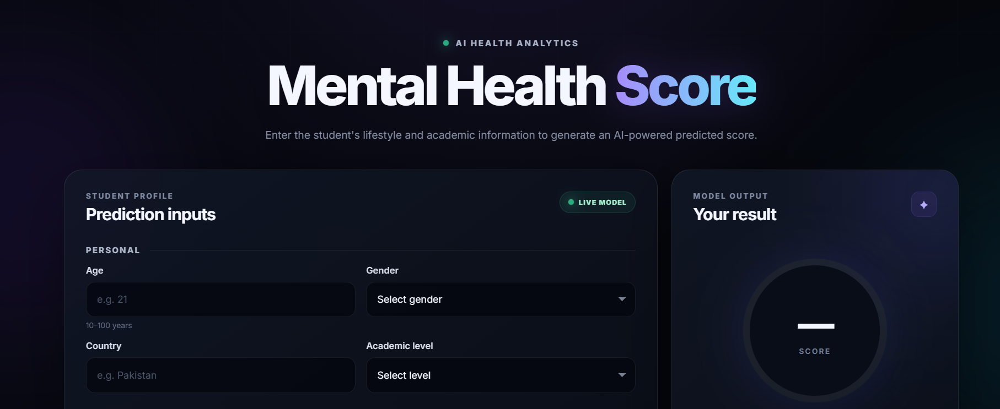
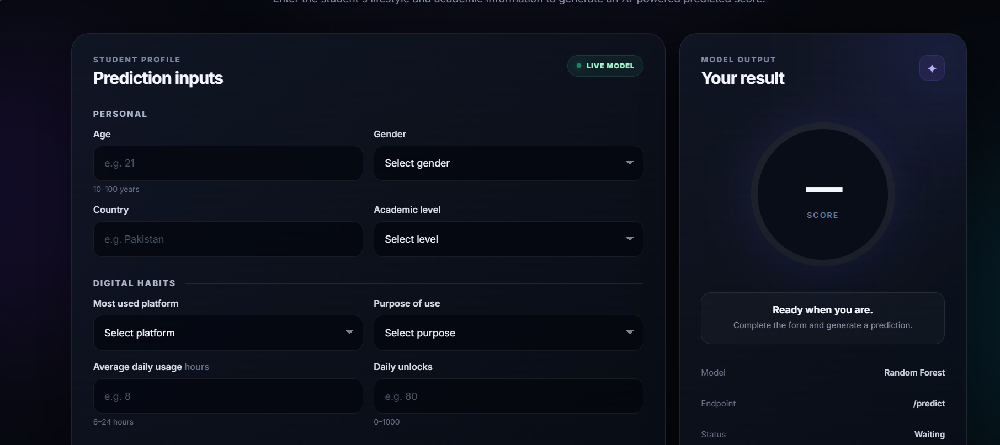
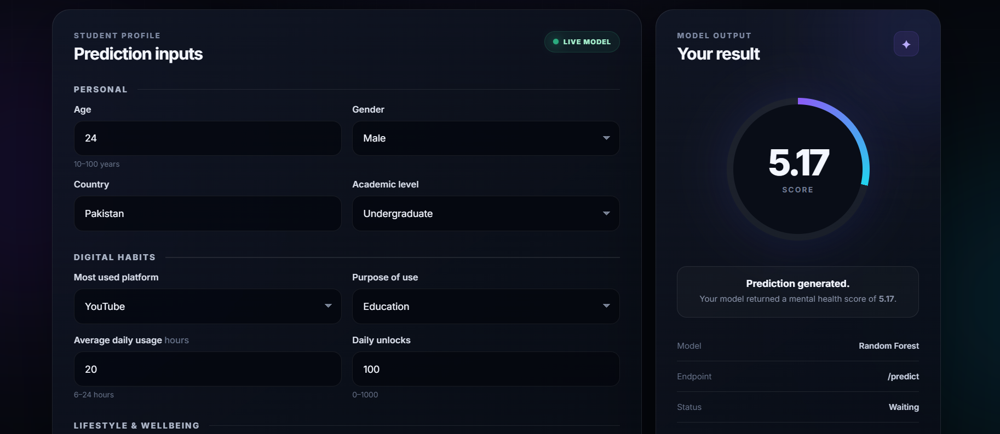

# Mental Health Prediction

A machine learning-based web application designed to predict mental health
scores based on social media usage and related behavioral factors.

## 📸 Screenshots

### Homepage



### Prediction Interface



### Prediction Results



## 🎯 Project Objective

The objective of this project is to analyze the relationship between
social media usage and mental health indicators and build a machine
learning model capable of predicting mental health scores.

## 🧠 Machine Learning

The project uses machine learning techniques to process the dataset,
identify relevant patterns, and predict the mental health score.

## 🛠️ Technologies Used

- Python
- Pandas
- NumPy
- Scikit-learn
- Matplotlib
- Jupyter Notebook
- HTML
- CSS
- JavaScript

## 📊 Dataset

The dataset contains information related to social media usage and
mental health factors.

## 🚀 How to Run

1. Clone the repository.
2. Install the required Python libraries.
3. Run the Python application.
4. Open the web interface in your browser.

## 📁 Project Structure

```text
Mental_Health_Predict/
│
├── screenshots/
├── main.py
├── mental_health_project.ipynb
├── Mental_Health_Score.pkl
├── index.html
├── script.js
├── style.css
└── README.md